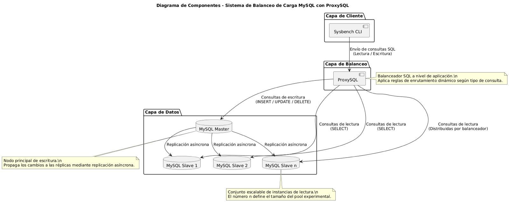

# Implementación de una Arquitectura de Alta Disponibilidad y Balanceo de Consultas MySQL usando Docker y ProxySQL


Este repositorio contiene el entregable final del proyecto de **Servicios Telemáticos** desarrollado por estudiantes de **Ingeniería Informática** de la **Universidad Autónoma de Occidente (Cali, Colombia)**. El objetivo principal es demostrar una solución completa, reproducible y de código abierto para alcanzar **alta disponibilidad** y **balanceo inteligente de consultas** en bases de datos MySQL mediante la integración de **ProxySQL** como capa de enrutamiento y **Docker Compose** como orquestador de contenedores.

La arquitectura implementada separa automáticamente las operaciones de escritura (dirigidas al nodo maestro) de las consultas de lectura (distribuidas entre dos réplicas esclavas).

## Arquitectura General



### Demo en video (2 minutos)
[](https://www.youtube.com/watch?v=5UUoAVL1c8Y])

*Despliegue, pruebas de rendimiento en vivo.*

### Presentación
[](https://www.canva.com/design/DAG4WVc_S0Y/9Yo0Jk42_DiMwT852oycww/view?utm_content=DAG4WVc_S0Y&utm_campaign=designshare&utm_medium=link2&utm_source=uniquelinks&utlId=h66aaa54fe0)


## Estructura del Repositorio

```bash
.
├── README.md                        # Este archivo
├── arquitectura.png                 # Diagrama de arquitectura
├── docker-compose.yml               # Orquestación de 5 contenedores
├── init-master.sql                  # Inicialización del maestro
├── init-slave.sql                   # Configuración automática de replicación
├── proxysql.cnf                     # Configuración completa de ProxySQL
├── pruebas/                         # Suite completa de pruebas automatizadas
  └── ... 
└── scripts/
    ├── common.sh                    # Biblioteca de utilidades (variables, funciones, reglas ProxySQL)
    └── verify.sh                    # Verificación rápida del clúster
```

## Requisitos del Entorno
- Docker ≥ 28.x
- Docker Compose ≥ 2.39.x (plugin docker compose)
- RAM ≥ 4 GB (8 GB recomendado para pruebas intensivas)
- CPU ≥ 2 núcleos

## Despliegue rápido

```bash
# 1. Clonar
git clone https://github.com/tu-usuario/MySQL-load-balancer.git
cd MySQL-load-balancer

# 2. Levantar clúster
docker compose up --build -d

# 3. Verificar
docker ps

#4. Panel de Admin de ProxySQL
docker exec -it proxysql mysql -u admin -padmin -h127.0.0.1 -P6032 --prompt='Admin> '
```

## Comandos útiles de ProxySQL
```sql
-- Usuarios configurados
SELECT * FROM mysql_users;

-- Nodos activos
SELECT hostgroup_id, srv_host, srv_port, status FROM runtime_mysql_servers;

-- Reglas de enrutamiento
SELECT rule_id, active, match_pattern, destination_hostgroup FROM mysql_query_rules;
```

## Pruebas y Validación

El comportamiento del balanceador fue evaluado mediante pruebas de lectura, escritura y carga mixta con Sysbench, verificando la correcta distribución de consultas y la tolerancia ante fallos de réplicas.

📘 [Consultar el Plan de Pruebas](https://github.com/SoyEtiago/MySQL-load-balancer/blob/main/pruebas/Plan%20de%20pruebas.md)

## Autores
- Etienne Santiago Samboni Piamba
- David Alejandro Penagos Valencia
- Santiago Collantes Nieto
- Juan Pablo Franco Herrera
- Miguel Angel Jiménez Trochez
